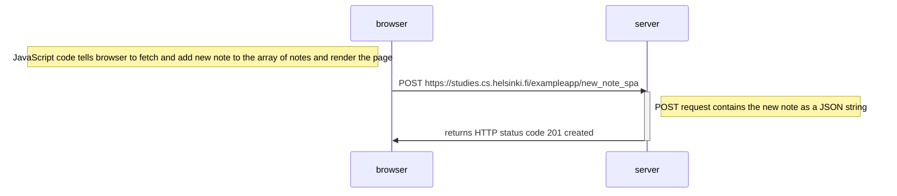

```mermaid
sequenceDiagram
    participant browser
    participant server


    Note left of browser: JavaScript code tells browser to fetch and add new note to the array of notes and render the page
    browser->>server: POST https://studies.cs.helsinki.fi/exampleapp/new_note_spa
    activate server
    Note right of server: POST request contains the new note as a JSON string
    server->>browser: returns HTTP status code 201 created
    deactivate server 

```